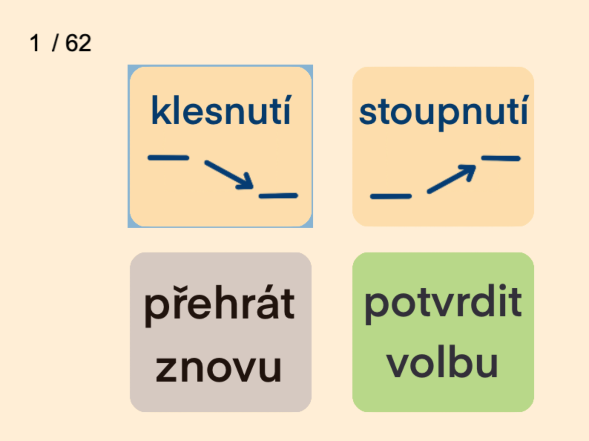
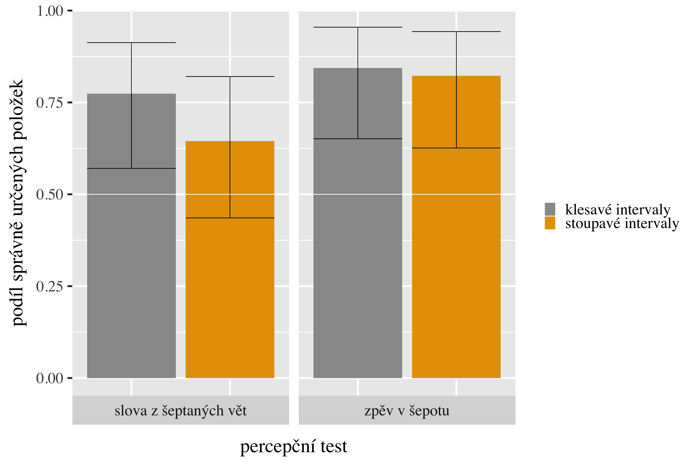
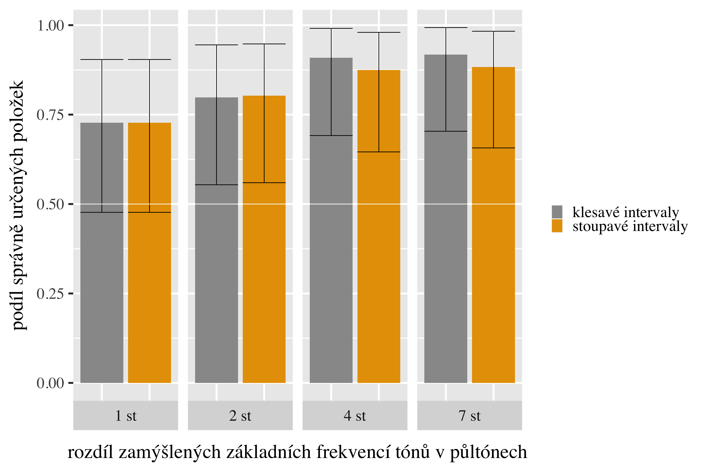
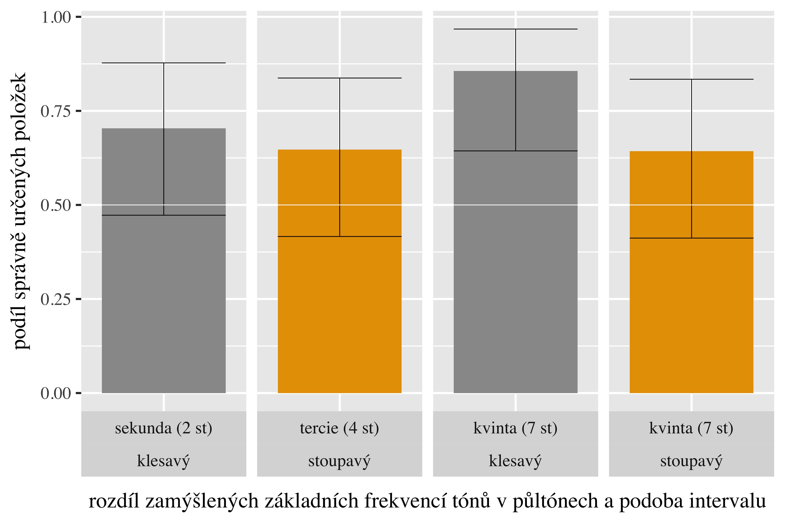
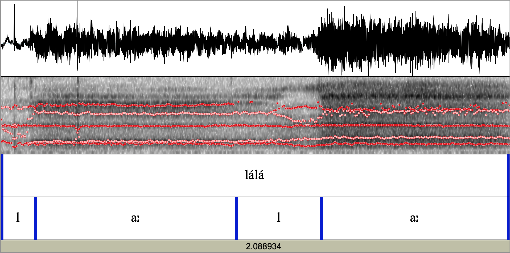
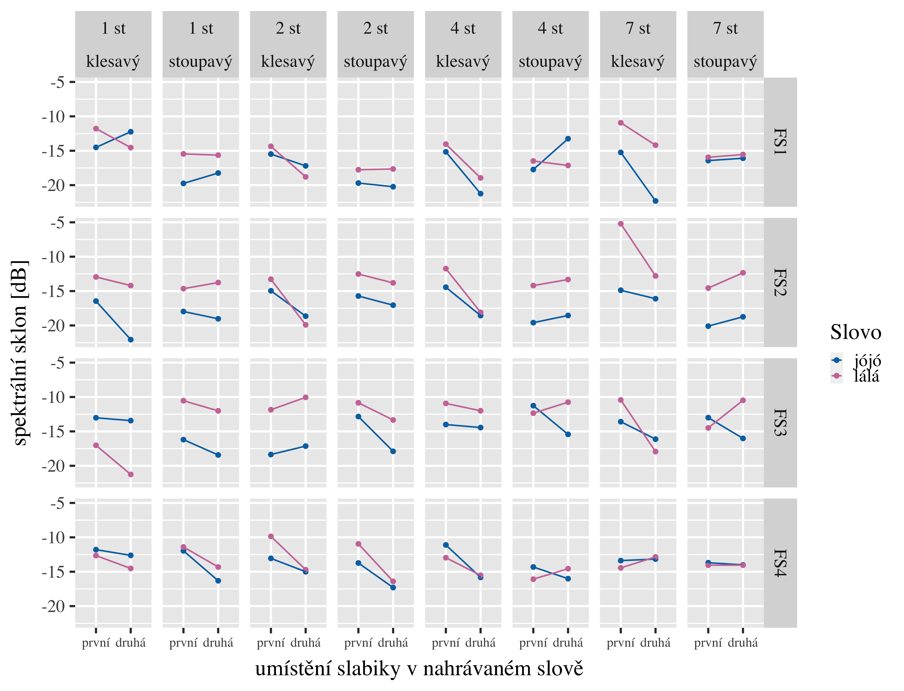
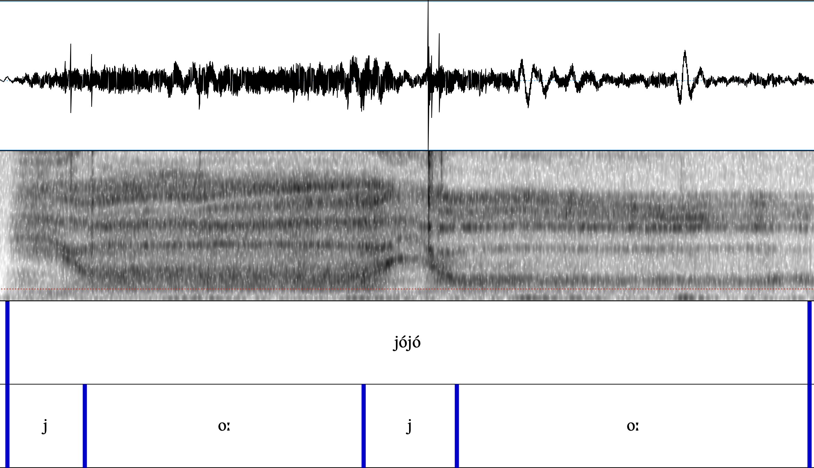
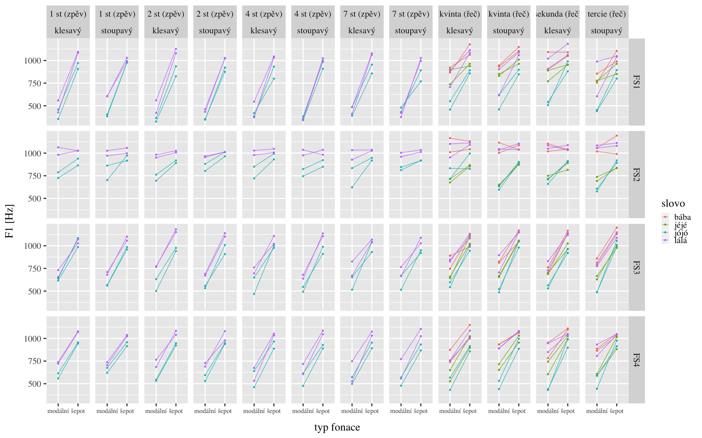
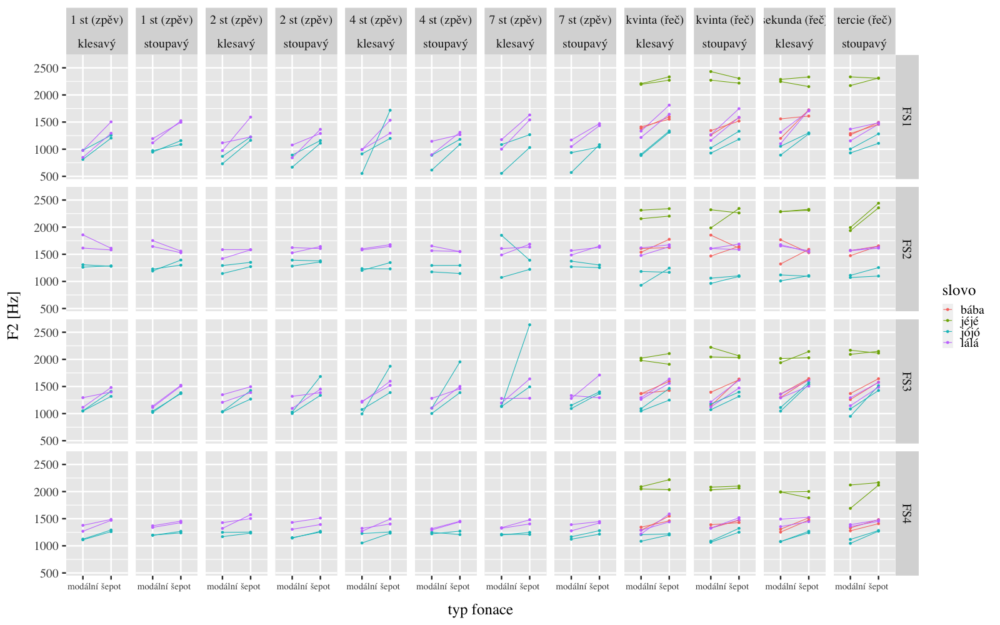
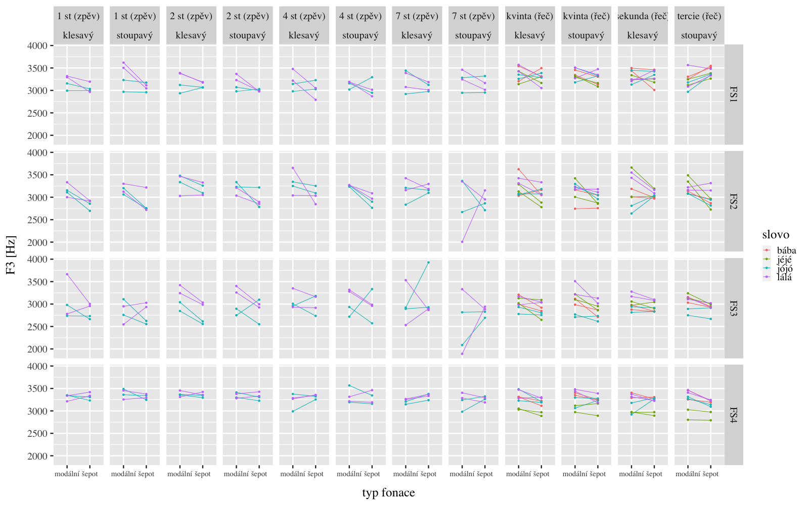

<link rel="stylesheet" href="stylesheet.css" type="text/css" charset="utf-8" />
<!-- font-family: 'museo300' -->

Realizace a vnímání melodie v šepotu
========================================================
author: Adléta Hanžlová
date:  2022
font-family: 'museo300'
transition: fade
autosize: true

BAKALÁŘSKÁ PRÁCE

[*](#/otazky)

Nahrávky
========================================================
__zpěv v šepotu__

- lálá, jójó

- stoupnutí/klesnutí

- 1 st, 2 st, 4 st, 7 st

***
__šeptané věty__

,,Řekl  [lálá] anebo [lala] ?/.``

- lálá, jéjé, bába, jójó

- 2 st klesnutí, 4 st stoupnutí, 7&nbsp;st stoupnutí/klesnutí

Percepční test
===============

Rozeznatelnost zamýšlené melodie
===============

Zpěv v šepotu
=======

Slova z šeptaných vět
=======

Akustická analýza
===
id: prehled

__zpěv v šepotu__

- F2, F3

- poměr F2 s okolními formanty (F2:F1, F3:F2)

- spektrální těžiště

- spektrální sklon

***
__šeptané věty__

- F2

- spektrální těžiště filtrovaného signálu (pásmová zádrž mezi 1000 a 6300 Hz)

F2 a okolní formanty
====================================
zpěv v šepotu, 7 st, stoupavý interval

[zvuk](obrazky_zvuky/up_7_lala_FS3.wav)

===

===
*
[**](https://adletka.eu/bp/)

Děkuji za pozornost.

===
id: otazky

*

======
zpěv v šepotu, 7 st, klesavý interval

[zvuk](obrazky_zvuky/down_7_jojo_FS3.wav)
[*](https://dood.al/pinktrombone/)

F1 v šepotu a modální fonaci
=====

F2 v šepotu a modální fonaci
=====

F3 v šepotu a modální fonaci
=====

[*](https://adletka.eu/bp/)

===
*
[**](https://adletka.eu/bp/)

